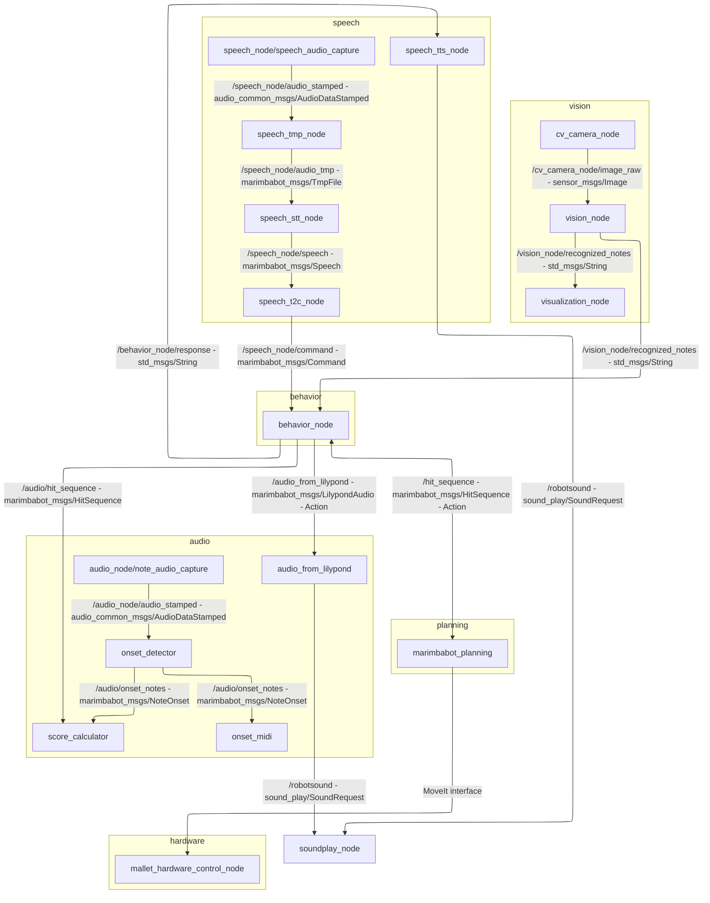

# TAMS Master Project 2022/2023

[](https://github.com/UHHRobotics22-23/marimbabot/actions/workflows/main.yml)
[](http://wiki.ros.org/noetic)

This repository contains the codebase for a [Marimba](https://en.wikipedia.org/wiki/Marimba) playing robot developed during the TAMS Master Project 2022/2023.

<p align="center">
  
</p>


## Video Demonstration
[](https://www.youtube.com/watch?v=73nEBY3L2v0)

## Project Overview

The project is separated into multiple different modules.
Each module contains localized documentation.

| Module                                                                                | Brief Description                                                                                   |
|---------------------------------------------------------------------------------------|-----------------------------------------------------------------------------------------------------|
| [marimbabot_audio](marimbabot_audio/)                                                 | Contains the audio analysis related code pieces                                                     |
| [marimbabot_behavior](marimbabot_behavior/)                                           | Implements the behaviour of the robot which interfaces with most other systems                      |
| [marimbabot_bringup](marimbabot_bringup/)                                             | The main bringup of the system used to for starting the project                                     |
| [marimbabot_description](marimbabot_description/)                                     | Contains the descriptions of the physical compontents of the robot for control and simulation       |
| [marimbabot_hardware](marimbabot_hardware/)                                           | The ros_control driver for the servo based hardware.                                                |
| [marimbabot_msgs](marimbabot_msgs/)                                                   | The shared ros message and action definitions                                                       |
| [marimbabot_planning](marimbabot_planning/)                                           | Contains the code for taking a input of notes and generate a trajectory for the robot               |
| [marimbabot_simulation](marimbabot_simulation/)                                       | Facilitates the simulation of the robot and marimba                                                 |
| [marimbabot_speech](marimbabot_speech/)                                               | Text to speech and speech to text and eventual command                                              |
| [marimbabot_ur5_flex_double_moveit_config](marimbabot_ur5_flex_double_moveit_config/) | MoveIT config for the UR5 with the marimba and the two mallet holder.                               |
| [marimbabot_ur5_moveit_config](marimbabot_ur5_moveit_config/)                         | MoveIT config for the UR5 and the marimba                                                           |
| [marimbabot_vision](marimbabot_vision/)                                               | Implements the vision model for the note recognition and facilitates the related dataset generation |
## Setup

The robot uses Ubuntu 20.04 and ROS noetic.
So make sure that it is installed on your system.
Visit the [ROS Wiki](http://wiki.ros.org/noetic/Installation) for further details. For Python version 3.8 is used.

Remember to source the ROS noetic installation in EACH terminal you use or add it once to your `.bashrc` file like this:

```bash
echo "source /opt/ros/noetic/setup.bash" >> ~/.bashrc
source ~/.bashrc
```

Make sure to [setup your ssh key](https://docs.github.com/en/authentication/connecting-to-github-with-ssh/adding-a-new-ssh-key-to-your-github-account) for easy synchronization without authorization.

We are using VCS for workspace management, so install it first:

```
sudo apt install python3-vcstool
```

Run the following commands:

```bash
# Create catkin workspace folder
mkdir -p catkin_ws/src

# Clone repository into source folder
cd catkin_ws/src
curl https://raw.githubusercontent.com/UHHRobotics22-23/marimbabot/main/workspace.repos | vcs import --recursive
cd ..

# Initialize workspace
catkin init

# Setup rosdep to download dependencies (only needed once after installing ROS)
sudo rosdep init

# Update rosdep packages list
rosdep update

# Install all dependencies needed by our repository
rosdep install --from-paths src --ignore-src -r -y
# Unfortunately this is needed as for unknown reasons the dependency is not recognized
rosdep install serial

# Install python dependencies
pip3 install wheel  # firstly install the wheel for further package building if you start from a empty virtual environment.
pip3 install -r src/marimbabot/requirements.txt

#install the precise engine
wget https://github.com/MycroftAI/mycroft-precise/releases/download/v0.3.0/precise-engine_0.3.0_x86_64.tar.gz
tar -zxvf precise-engine_0.3.0_x86_64.tar.gz -C src/marimbabot/marimbabot_speech/utils/kws/
rm precise-engine_0.3.0_x86_64.tar.gz
```

Now you are ready to go.

## Update workspace

You might want to update the state of the software and get recent changes.
Normally a simple pull should be enough.

```bash
# Go to the repository
cd catkin_ws/src/marimbabot

# Pull recent changes
git pull
```

You sometimes also want to update the dependencies if new ones have been introduced. You can do this like this:

```bash
# Go to workspace
cd catkin_ws

# Update rosdep packages list
rosdep update

# Install new dependencies
rosdep install --from-paths src --ignore-src -r -y
# Unfortunately this is needed as for unknown reasons the dependency is not recognized
sudo apt install ros-noetic-serial

# Install new python dependencies
pip3 install --upgrade -r requirements.txt
```

## Build

To build the full software stack one needs to execute the following command in the `catkin_ws` folder or any of its subdirectories:

```bash
# Go to workspace
cd catkin_ws

catkin build
```

## Launch

Before you launch any of the provided launch files remember to source the current workspace by typing:

```bash
# Go to workspace
cd catkin_ws

source devel/setup.bash
```

#### Prerequisites and Configuration
Additionally to the UR5, the following devices have to be connected and configured before launching the project:
1. Logitech StreamCam (packages marimbabot_vision and marimbabot_speech)
2. Scarlett 2i2 USB Audio Interface (package marimbabot_audio)
3. Wifi connection to the MalletHolder (package marimbabot_hardware)

#### Logitech StreamCam (required for packages marimbabot_vision and marimbabot_speech):
Change the parameter <i>device</i> of the node <i>audio_capture</i> in the [launch file](marimbabot_speech/launch/command_recognition.launch) of the package marimbabot_speech:

```bash
marimbabot_speech/launch/command_recognition.launch
```

and modify the <i>device_id</i> parameter in the [configuration file](marimbabot_vision/config/cv_camera.yaml) of the package marimbabot_vision:

```bash
marimbabot_vision/config/cv_camera.yaml
```

#### Scarlett 2i2 USB Audio Interface (required for package marimbabot_audio):

Adjust the <i>device</i> parameter for the <i>note_audio_capture</i> node in the [launch file](marimbabot_audio/launch/audio_feedback.launch) of the package marimbabot_audio:

```bash
marimbabot_audio/launch/audio_feedback.launch
```

#### Wifi connection to the MalletHolder
You should be connected to its Wifi. Please see the [README](marimbabot_hardware/README.md) of the package marimbabot_hardware and [README](marimbabot_bringup/README.md) of the package marimbabot_bringup for further information.


#### Launch the whole project
In order to run the whole project on the real robot, one has to run two launch files. First, the launch file that sets up the robot and its hardware:

```bash
roslaunch marimbabot_bringup marimbabot_ur5_bringup.launch
```

Second, the launch file that brings up the launch file for each package:


```bash
roslaunch marimbabot_bringup marimbabot.launch
```

#### Note for development: Add the main launch files to the bringup if they are created.

To run the UR5 setup with the MoveIt Demo Mode and two mallets run

```bash
roslaunch marimbabot_ur5_flex_double_moveit_config demo.launch
```

you should be able to test simple planning things with it.

To view the marimba model in RViz run

```bash
roslaunch marimbabot_description marimba_rviz.launch
```

## Launch single packages

To launch a single package run this command each package:

```bash
roslaunch marimbabot_audio marimbabot.launch
# or
roslaunch marimbabot_planning marimbabot.launch
# or
roslaunch marimbabot_vision marimbabot.launch
```

This comes handy for purposes like debugging or testing.

## How do I contribute

To contribute changes to this repository go to the repository in your file system and create a new branch. Replace the placeholder `fix/my_dummy_branch` with a short but descriptive branch name:

```bash
git switch -c fix/my_dummy_branch
```

Now commit your changes and push them:

```bash
# Run this once if the repo is new. It will save you an additional command when pushing new branches.
git config push.autoSetupRemote true

# Now we can push our changes
git push
```

Now you can [create a pull request](https://docs.github.com/en/pull-requests/collaborating-with-pull-requests/proposing-changes-to-your-work-with-pull-requests/creating-a-pull-request#creating-the-pull-request) for your branch and merge it (after it is approved) into the `main` branch using the GitHub website.

## Additional Resources

### MoveIT config
The project contains two MoveIT configuration definitions ([marimbabot_ur5_moveit_config](marimbabot_ur5_moveit_config/) and [marimbabot_ur5_flex_double_moveit_config](marimbabot_ur5_flex_double_moveit_config/)).

The MoveIT configs were generated using the [MoveIT Setup Assistant](http://docs.ros.org/en/kinetic/api/moveit_tutorials/html/doc/setup_assistant/setup_assistant_tutorial.html).
When the description of the robot is changed and contains new controlable joints.

Generally the main additional work required for the MoveIT config setup is the collision matrix setup, where non-colliding elements have to be removed from the collision checks.

### ROS Node Diagram


## Declaration
The file [onset_detection.py](https://github.com/UHHRobotics22-23/marimbabot/blob/main/marimbabot_audio/scripts/onset_detection.py) and sloe the [messages](https://github.com/UHHRobotics22-23/marimbabot/blob/main/marimbabot_audio/msg) in the package marimbabot_audio is a modification of [@v4hn](https://github.com/v4hn)'s base [repository](https://github.com/TAMS-Group/music_perception.git).
