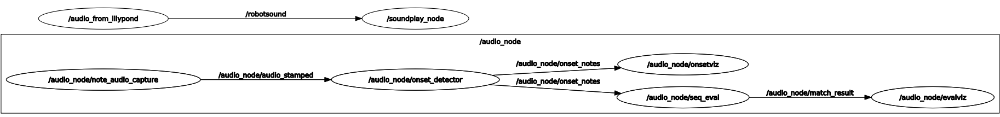

# TAMS Master Project 2022/2023 - Audio Processing

## 1. Motivation

The robot's performance of playing the marimba need to be evaluated. Therefore, this submodule is designed to can evaluate the music produced by robot through the audio feedback. It can detect the western music note by the raw audio input, and visualize it in form of midi figure and  Constant-Q transform spectrum, also there is a final score for evaluate the final motion.  Moreover, it can synthesis the music from lilypond.

## 2. Dependencies

### 2.1 python packages

```
abjad==3.4
crepe==0.0.13
librosa==0.9.2
midi2audio==0.1.1
numpy==1.23.3
opencv-python==4.7.0.68
pretty-midi==0.2.10
tensorflow==2.13
```

### 2.2 Ros official packages

-   fluidsynth
-   audio_capture
-   sound_play

## 3. Overview

### 3.1 Folder overview

The following folder tree structure show some important files, unimportant files are ignored.

```bash
├── launch
│   ├── audio_feedback.launch  # To lauch the music note detector, you can tune the parametes here.
│   ├── marimbabot.launch  # main launch file of this submodule.
│   └── open_rviz.launch  # the launch file the open the rviz.
└── src
    ├── audio_from_lilypond.py  # music systhesis,  test music sequence to audio music 
    ├── eval_visualization.py  # midi visualiazation for evaluation, the mismatch the note wil be shown here.
    ├── onset_detection.py  # onset detection and music note classification, also spectrum visualization.
    ├── onsets_visualization.py  #  the live midi visualization.
    └── sequence_evaluation.py  # music evaluation, compare the groundtruth with the robot performance.
```

### 3.2 Nodes overview



-   **/audio_node/node_audio_capture**: capture the music to raw data.
-   **/audio_node/onset_detector**: detect the music notes by raw data input.
-   **/audio_node/seq_eval**: compare the music notes sequence between the ground-truth and robot performance.
-   **/audio_node/onsetviz**: visualization of onset notes in format of live midi. 
-   **/audio_node/evalviz**: visualization of evaluation result in format of a midi figure. 
-   **/audio_from_lilypond**: synthesize the audio from lilypond, and play it.

## 4. Pipeline of music note detection 

1.  **Audio capture**:
    The audio raw data will be captured to `/audio_node/audio_stamped`.
2.  **Music note detection**(`src/onset_detection.py`): 
    1.   Continuing **receive chunks** **of raw data** until 1 second data is gathered, and convert it to float array.
    2.  Apply **Constant-Q Transform(CQT)** to it, that is, transforms a data series to the frequency domain. Its design is suited for musical representation.
    3.  Then, use the **peak-pick based onset detection** to detect the frame of peaks, i.e. the candidates of music onset events .
    4.  Select a chunk of  CQT data after each frame of peaks, and send it to **music classification** model, i.e. [Crepe](https://github.com/marl/crepe), a monophonic pitch tracker based on DNN.
    5.  **Visualize** the detected music note to CQT spectrum to `/audio_node/spectrogram_img` , also publish the detected notes to `/audio_node/onset_notes`.
    6.  **Live midi visualization** of music notes: `src/onsets_visualization.py`.
3.  **Sequence evaluation**(`src/sequence_evaluation.py`):
    1.   It will keep listen the detected note, and that is produced by the robot, and storage it to a cache list.
    2.  Once a ground-truth is received from topic `/audio/hit_sequence`, it will retrieve the related music note in cache list according to the time slot of the ground-truth.
    3.  Then compare two sequence and get the matched result. And publish the matched results to `/audio_node/match_result`.
    4.  Visualization of evaluation results: `src/eval_visualization.py`

## 5. Node list

*Only the primary topic and node will be covered here.*

-   #### /audio_node/note_audio_capture:

    -   **Description**: capture the audio in format of raw data.
    -   **Output**:
        -   Message type: [`AudioDataStamped.msg`](https://github.com/ros-drivers/audio_common/blob/master/audio_common_msgs/msg/AudioDataStamped.msg)
        -   topic: `/audio_node/audio_stamped`
        -   Audio format: `wave` format in `bit-rate 44100` with `depth 16` and `mono channel`, and it correspond to S16LE of PCM sample formats.

-   #### /audio_node/onset_detector

    -   **Description**: detect the music note from the raw data, and publish the detected music note also the spectrum
    -   **Input**: `uint8[]` from topic `/audio_node/audio_stamped`
    -   **Output_1**: Music note
        -   Topic: `/audio_node/onset_notes`	
        -   Message type: [`NoteOnset.msg`](../marimbabot_msgs/msg/NoteOnset.msg)
    -   **Output_2**: normalized Constant-Q transform spectrum include the onset event(vertical white line, aka. candidates) and detected music note(horizontal green line).
        -   Topic: `/audio_node/spectrogram_img` 
        -   Message type: [`sensor_msgs/Image.msg`](http://docs.ros.org/en/noetic/api/sensor_msgs/html/msg/Image.html)

-   #### /audio_node/seq_eval

    -   **Description**: Compare the music sequence from the ground-truth and the robot-played music, calculate the score and visualize the match result.
    -   **Input_1**: ground-truth music sequence
        -   Topic: `/audio_node/hit_sequence`
        -   Message type: [`HitSequence.msg`](../marimbabot_msgs/msg/HitSequence.msg)
    -   **Input_2:** robot-played music note
        -   Topic: `/audio_node/onset_notes`
        -   Message type:[`NoteOnset.msg`](../marimbabot_msgs/msg/NoteOnset.msg)
    -   **output**: match results
        -   Topic: `/audio_node/match_result`
        -   Message type: [SequenceMatchResult.msg](../marimbabot_msgs/msg/SequenceMatchResult.msg)

-   #### /audio_node/onsetviz

    -   **Description**: visualize the music note in live midi
    -   **Input**: music notes
        -   Topic: `/audio_node/onset_notes`
        -   Message type:[`NoteOnset.msg`](../marimbabot_msgs/msg/NoteOnset.msg)
    -   **Output:** midi image
        -   Topic: `/audio_node/live_midi_img`
        -   Message type: [`sensor_msgs/Image.msg`](http://docs.ros.org/en/noetic/api/sensor_msgs/html/msg/Image.html)

-   #### /audio_node/evalviz

    -   **Description**: visualize the match result in live midi
    -   **Input**: match result
        -   Topic:  `/audio_node/match_result`
        -   Message type: [SequenceMatchResult.msg](../marimbabot_msgs/msg/SequenceMatchResult.msg)
    -   **Output:** midi image
        -   Topic: `/audio_node/feedback_img`
        -   Message type: [`sensor_msgs/Image.msg`](http://docs.ros.org/en/noetic/api/sensor_msgs/html/msg/Image.html)

-   #### /audio_from_lilypond

    -   **Description**: Synthesize the music from lilypond
    -   **Input**:  lilypond
        -   Action name: `audio_from_lilypond`
        -   Action type: [`LilypondAudio.action`](../marimbabot_msgs/action/LilypondAudio.action)

## 6. Topic list

| Topic                       | Description                                                  | Message Type                                                 |
| --------------------------- | ------------------------------------------------------------ | ------------------------------------------------------------ |
| /audio_node/audio           | publish audio data                                           | [AudioData.msg](https://github.com/ros-drivers/audio_common/blob/master/audio_common_msgs/msg/AudioData.msg) |
| /audio_node/audio_info      | description data of audio                                    | [AudioInfo.msg](http://docs.ros.org/en/noetic/api/audio_common_msgs/html/msg/AudioInfo.html) |
| /audio_node/audio_stamped   | publish audio data with time stamp                           | [AudioDataStamped.msg](https://github.com/ros-drivers/audio_common/blob/master/audio_common_msgs/msg/AudioDataStamped.msg) |
| /audio_node/compute_time    | the computing time for music note detection of 1 sec data chunk | Float32                                                      |
| /audio_node/cqt             | spectrum of constant-Q transform from raw data input         | [CQTStamped](../marimbabot_msgs/msg/CQTStamped.msg)          |
| /audio_node/feedback_img    | the MIDI figure of final evaluation                          | [Image.msg](http://docs.ros.org/en/noetic/api/sensor_msgs/html/msg/Image.html) |
| /audio_node/live_midi_img   | live MIDI figure to show the detection of music note         | [Image.msg](http://docs.ros.org/en/noetic/api/sensor_msgs/html/msg/Image.html) |
| /audio_node/match_result    | the evaluation result between ground-truth and perceived music notes. | [SequenceMatchResult.msg](../marimbabot_msgs/msg/SequenceMatchResult.msg) |
| /audio_node/onset_notes     | the detected music note                                      | [NoteOnset.msg](../marimbabot_msgs/msg/NoteOnset.msg)        |
| /audio_node/spectrogram_img | normalized constant-Q transform spectrum figure              | [Image.msg](http://docs.ros.org/en/noetic/api/sensor_msgs/html/msg/Image.html) |
| /sound_play                 | play the music                                               | [SoundRequest.msg](http://docs.ros.org/en/jade/api/sound_play/html/msg/SoundRequest.html) |
| /audio_from_lilypond        | music synthesis from  lilypond input                         | [LilypondAudio.action](../marimbabot_msgs/action/LilypondAudio.action) |

