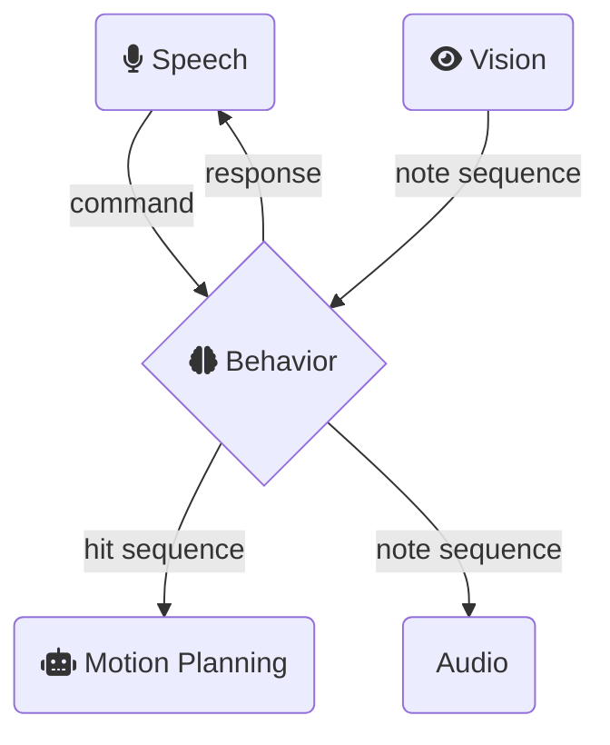

# TAMS Master Project 2022/2023 - Behavior

## 1. Description

The Behavior node acts as the central action decider and communication controller of the Marimbabot system.
It makes use of recognized commands in order to make decisions, modify a given lilypond string, calculate a corresponding Hit Sequence, and publishes its results to corresponding topics.
The included Command GUI can be used for testing the behavior by administering commands without the need of speech recognition.

### 2 Folder Structure

Following files contain the important code that determines the functionality of the Behavior:

```bash
├── launch
│   ├── marimbabot.launch  # main launch file of this submodule.
│   └── test_behavior.launch  # launch file for testing the behavior. Additionally launches the Vision node and test_speech_synthesis, and starts commandGUI.py and audio_from_ilypond.py.
└── src/marimbabot_behavior
    ├── behavior_node.py # Action decider that processes commands and publishes to topics.
    ├── interpreter.py # Calculates a Hit Sequence Message (for Planning- and Audio node) from the active lilypond string.
    ├── commandGUI.py # Graphical User Interface for easy input lilypond sequence and command admission.
  
```

## 3. Communication Network



### 3.1 Subscriber Topics

| Topic name                     | Message Description                              | Message type                                                 |
| ------------------------------ | ------------------------------------------------ | ------------------------------------------------------------ |
| /speech_node/command           | recognized command from Speech node              | [Command.msg](marimbabot_msgs/msg/Command.msg)            |
| /vision_node/recognized_notes  | recognized lilypond sequence from Vision node    | [String.msg](http://docs.ros.org/en/melodic/api/std_msgs/html/msg/String.html) |
| /command_gui/note_sequence     | input lilypond sequence from the Command GUI     | [String.msg](http://docs.ros.org/en/melodic/api/std_msgs/html/msg/String.html) |

### 3.2 Publisher Topics

| Topic name                     | Message Description                              | Message type                                                 |
| ------------------------------ | ------------------------------------------------ | ------------------------------------------------------------ |
| /behavior_node/response        | Response for the TTS                             | [String.msg](http://docs.ros.org/en/melodic/api/std_msgs/html/msg/String.html) |
| /behavior_node/note_sequence   | active lilypond sequence for the command GUI     | [String.msg](http://docs.ros.org/en/melodic/api/std_msgs/html/msg/String.html) |

### 3.3 Action Clients

| Action name                                                      | Goal Description                                 | Goal Message type                                            |
| ---------------------------------------------------------------- | ------------------------------------------------ | ------------------------------------------------------------ |
| [HitSequenceAction](marimbabot_msgs/action/HitSequence.action)    | Hit sequence for the UR5 Motion Planning         | [HitSequence.msg](marimbabot_msgs/msg/HitSequence.msg)    |
| [LilypondAudioAction](marimbabot_msgs/action/LilypondAudio.action)| Lilypond string for the Audio Preview            | [String.msg](http://docs.ros.org/en/melodic/api/std_msgs/html/msg/String.html) |
