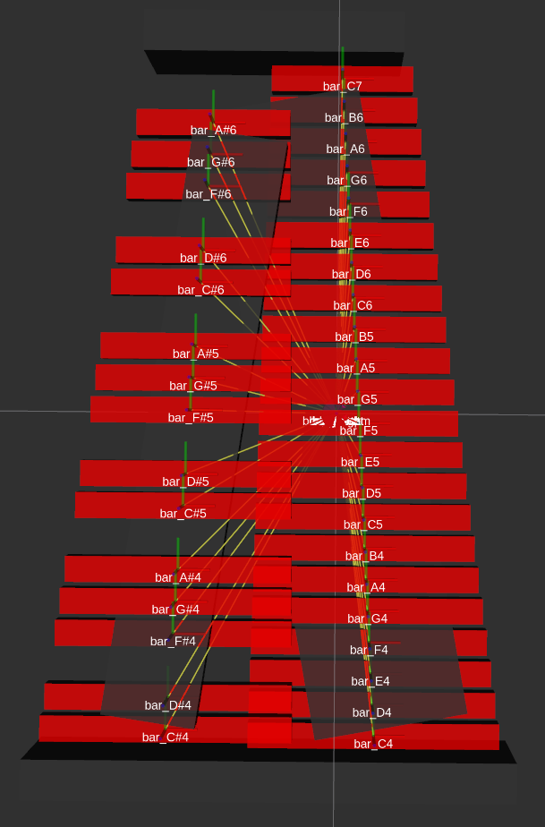

# Marimbabot Description package

The description package contains all the models used in the control of the physical robot and the simulation.

## URDF/Xacro Model

The URDF models are generated using `xacro`, for example with the template `urdf/marimba.urdf.xacro` for the marimba.
See `marimba_display.launch` to see how it's run for RViz.
The main files are found in the [urdf](urdf/) folder.
Associated meshes are stored in the [mesh](mesh/) folder using the stl format (normally binary flavour).

<!-- TODO What is with the gazebo_gripper_transmissions.xacro file? -->
### Main Xacro Files

The central xacro file is [marimbabot_ur5.urdf.xacro](urdf/marimbabot_ur5.urdf.xacro).
The robot, marimba and mallet holder models are all loaded from this file.

Further configurations for the joints and ur5 controllers are imported from the [config](config/) folder.

When running the marimbabot ur5 launch file, a parameter for the mallet mount can be specified. By default this remains the fixed mount for now  
- fixed - the standard one mallet fixed mount
- flex - the one mallet flexible mount
- flex_double - the two mallet flexible mount with the integrated servo
```bash
roslaunch marimbabot_description marimbobot_ur5_display.launch mallet_holder_type:="flex_double"
```

#### Marimba

The marimba is modeled by the [marimba.urdf.xacro](urdf/marimba.urdf.xacro) file.
Each bar is modelled on its own to allow for automatic targeting based on the tone and midi output generation in the simulation.

<!-- Please expand if there is more to say here -->

#### Mallet Holder
Multiple versions of the mallet holder were used in the development phase of the project.

The final version is the [two_mallet_compliance_holder.urdf.xacro](urdf/two_mallet_compliance_holder.urdf.xacro). It contains two mallets on flexible holders with one being controlled by a servo.
It is selected with the "flex_double" option.

For one mallet implementations a static, single mallet was used.
The model [static_mallet_holder.urdf](urdf/static_mallet_holder.urdf) is selected with the "fixed" option

The [flex_mallet_holder.urdf](urdf/flex_mallet_holder.urdf) was rarely used in the development phase.
It is a single mallet on a flexible mount. The "flex" option selects this version.

### Secondary
The marimba model used to helper files in its xacro definition.
The [materials.xacro](urdf/materials.xacro) defines the used materials in the model.
[utilities.xacro](urdf/utilities.xacro) contains various helper functions to create urdf objects and shapes with many defaults applied.

## Launch files
The launch file can be found in the [launch](launch/) folder and are used in the launch files of the [bringup package](../marimbabot_bringup/) or for rviz based debugging or inspection.
### Main

The main launch file for the description package is [marimbabot_ur5_upload.launch](launch/marimbabot_ur5_upload.launch)
### RViz (Testing)

The testing is setup for mostly inspecting models in rviz. The testing environments can be loaded with the launch files in the [launch](launch/) folder.

Further rviz config files used in some of the testing launch files are found in the [config](config/) folder.

To see the a model in RViz, [prepare your environment for the project](../README.md#setup) and run:

```bash
roslaunch marimbabot_description marimba_display.launch
```
The marimba model will be displayed. Other files can be used in a similar fasion.



One further RViz launch file is the [marimbabot_ur5_display.launch](launch/ marimbabot_ur5_display.launch) which shows whole setup of the scene.

The [flex_mallet_holder.launch](launch/flex_mallet_holder.launch) and [two_mallet_display.launch](launch/two_mallet_display.launch) are used to develop and debug the mallet holder models.