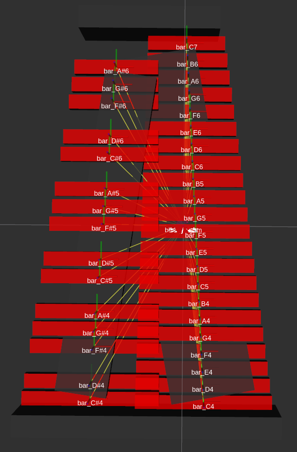

## Marimbabot Simulation package


### URDF/Xacro Model

The URDF model is generated using `xacro`, with the template `urdf/marimba.urdf.xacro`. See `marimba_display.launch` to see how it's run for RViz.


### RViz

To see the model in RViz, [prepare your environment for the project](../README.md#setup) and run:

```bash
roslaunch marimbabot_sim marimba_display.launch
```

