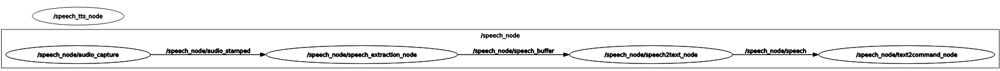

# TAMS Master Project 2022/2023 - Command recognition

## 1. Motivation

We need a interface for giving the command to robot, therefore we build a command recognition system to extract the command from human speech, and use speech synthesis for interaction feedback. 

## 2. Dependencies

### 2.1 python packages

```
mycroft-mimic3-tts==0.2.4
numpy==1.23.3
pytorch_lightning==1.8.1
torch==1.13.1
openai-whisper==20230314
webrtcvad==2.0.10
playsound==1.3.0
```

### 2.2 Ros dependecies

-   audio_common_msgs
-   python3-precise-runner-pip
-   sound_play

### 2.3 Precise_engine

You need to download it and extract the binary file to `marimbabot_speech/utils/kws/`

```bash
#install the precise engine
wget https://github.com/MycroftAI/mycroft-precise/releases/download/v0.3.0/precise-engine_0.3.0_x86_64.tar.gz
tar -zxvf precise-*.tar.gz -C src/marimbabot/marimbabot_speech/utils/kws/
rm precise-*.tar.gz
```

## 3. Overview

### 3.1 Folder overview

The following folder tree structure show some important files, unimportant files are ignored.

```bash
├── launch
│   ├── command_recognition.launch  # launch the command recognization
│   ├── marimbabot.launch
│   └── test_speech_syntesis.launch  # launch the speech synthesis
├── src
│   ├── speech2text.py  # speech recognization from speech raw data
│   ├── speech_extraction.py  # extract whole sentence of speech signal in format of raw data 
│   ├── text2command.py  # extract the command from text
│   └── text2speech.py  # speech sythesis
└── utils
    └── kws  # the folder for auxiliary file of keyword spotting
        ├── hi-marimbabot.pb  # the model file for keyword spotting
        └── reminder.wav  # a small music file to denote the keyword is spotted
```

### 3.2 Nodes overview



-   **/speech_node/audio_capture**: capture the speech to raw data.
-   **/speech_node/speech_extraction_node**: extract a whole sentence of speech in format of raw data. There is two primary parts, keyword spotting which is based on [mycroft-precise](https://github.com/MycroftAI/mycroft-precise), voice activity detection is based [webrtcvad](https://github.com/wiseman/py-webrtcvad).
-   **/speech_node/speech2text_node**: Speech transcription which is based on [whisper](https://github.com/openai/whisper).
-   **/speech_node/text2command_node**:  extract the command by regular expression.
-   **/speech_tts_node**:  speech synthesis.

## 4. Pipeline of command recognition 

1.  **Audio capture**:
    The audio raw data will be captured to `/speech_node/audio_stamped`.
2.  **Speech extraction**(`Using some regular expression to extract the command from recognized text.`): 
    1.   Listening the keyword by the keyword spotting tools([mycroft-precise](https://github.com/MycroftAI/mycroft-precise)), once the keyword is spotted, you will hear a tone to remind you.
    2.   Once the keyword is spotted, gather the data chunks by voice activity detection([webrtcvad](https://github.com/wiseman/py-webrtcvad)), until 1 second successive silence is reached, we can consider those chunks as a whole sentence, then forward it to the next step.
3.  **Speech Transcription**(`src/speech2text.py`)
    1.  Using [whisper](https://github.com/openai/whisper) to transcript the speech to text by gathered data chunks.

4.  **Command extraction**(`src/text2command.py`):
    1.   Using regular expression for command extraction.

## 5. Command examples

1.  For speed setup:

    1.  "play faster by 20 bpm"
        `{"behavior": "play", "action": "increase speed", "parameter": "20"}`.
    2.  "play slower by 40 bpm"
        `{"behavior": "play", "action": "decrease speed", "parameter": "40"}`
    3.  "play in 20 bpm"
        `{"behavior": "play", "action": "setup speed", "parameter": "20"}`

2.  For volume setup:

    1.  "play louder by 1 step"
        `{"behavior": "play", "action": "increase volume", "parameter": "1"}`
    2.  "play softer by 2 steps"
        `{"behavior": "play", "action": "decrease volume", "parameter": "2"}`

3.  "play in the loop":
    `{"behavior": "play", "action": "loop", "parameter": ""}`.

4.  music synthesis:
    `play` of behavior can be replaced by `preview`, that means, synthesize the music and play it, such as:

    "preview faster by 20 bpm"
    `{"behavior": "preview", "action": "setup speed", "parameter": "20"}`
    or "preview in the loop"
    `{"behavior": "preview", "action": "loop", "parameter": ""}`.

5.  other:

    1.  "stop": stop the motion of the robot or the synthesized music.
        `{"behavior": "stop", "action": "", "parameter": ""}`.
    2.  "read": read the music note from white board.
        `{"behavior": "read", "action": "", "parameter": ""}`.

## 6. Topic list

| Topic name                 | Description                                      | Message type                                                 |
| -------------------------- | ------------------------------------------------ | ------------------------------------------------------------ |
| /robotsound                | publish sound to audio node (sound_play package) | [SoundRequest.msg](http://docs.ros.org/en/jade/api/sound_play/html/msg/SoundRequest.html) |
| /speech_node/audio         | publish audio data                               | [AudioData.msg](https://github.com/ros-drivers/audio_common/blob/master/audio_common_msgs/msg/AudioData.msg) |
| /speech_node/audio_info    | description data of audio                        | [AudioInfo.msg](http://docs.ros.org/en/noetic/api/audio_common_msgs/html/msg/AudioInfo.html) |
| /speech_node/audio_stamped | publish audio data with time stamp               | [AudioDataStamped.msg](https://github.com/ros-drivers/audio_common/blob/master/audio_common_msgs/msg/AudioDataStamped.msg) |
| /speech_node/command       | publish command for robot                        | [Command.msg](../marimbabot_msgs/msg/Command.msg)            |
| /speech_node/speech        | publish result of speech transcription           | [Speech.msg](../marimbabot_msgs/msg/Speech.msg)              |

## 7. Training and using of keyword spotting model

please refer to this branch: [kws_training](https://github.com/UHHRobotics22-23/marimbabot/tree/kws_training).